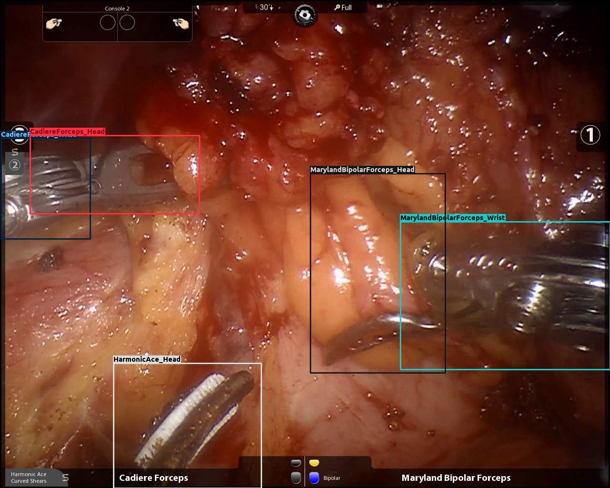
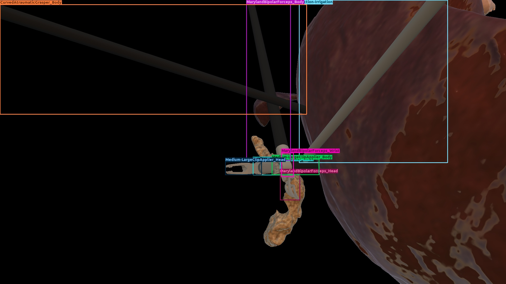
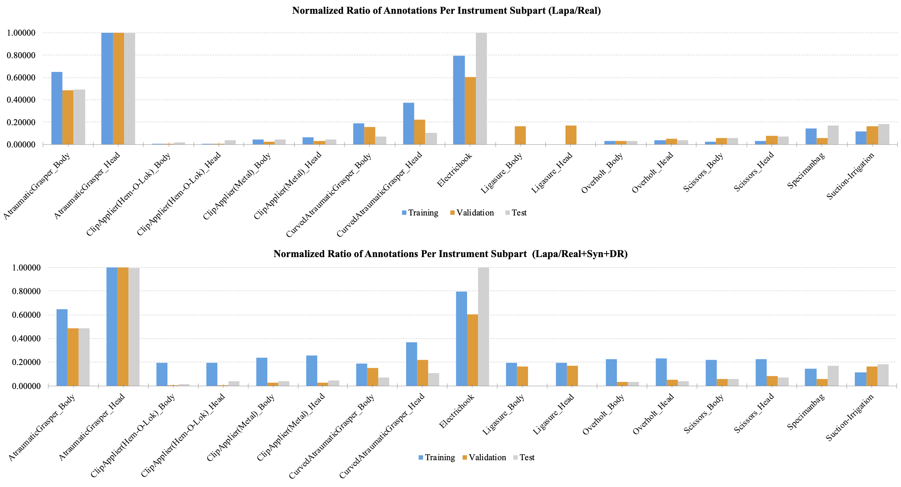
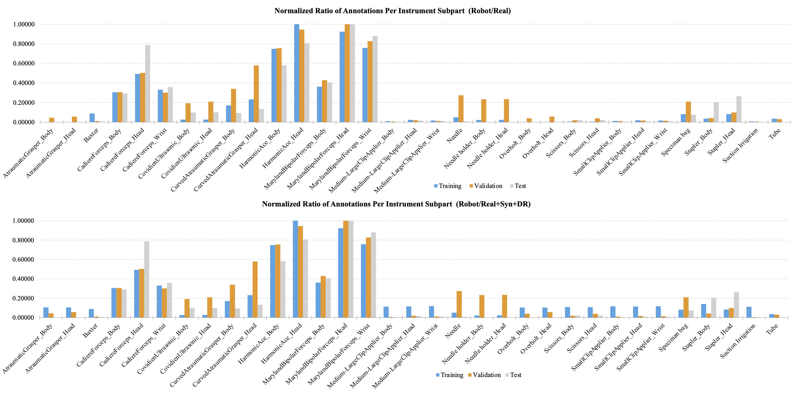
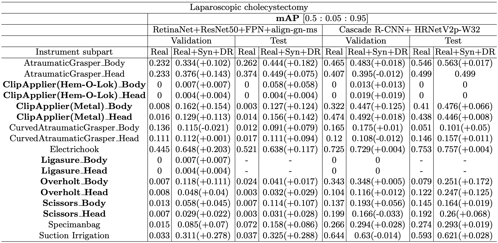
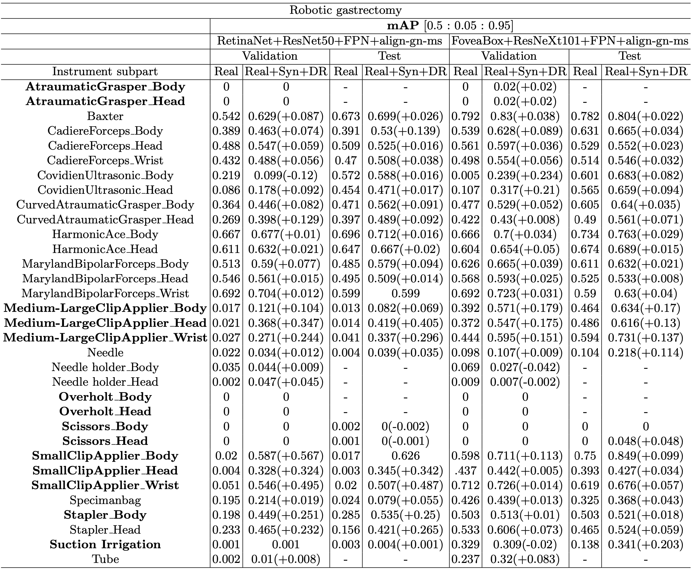
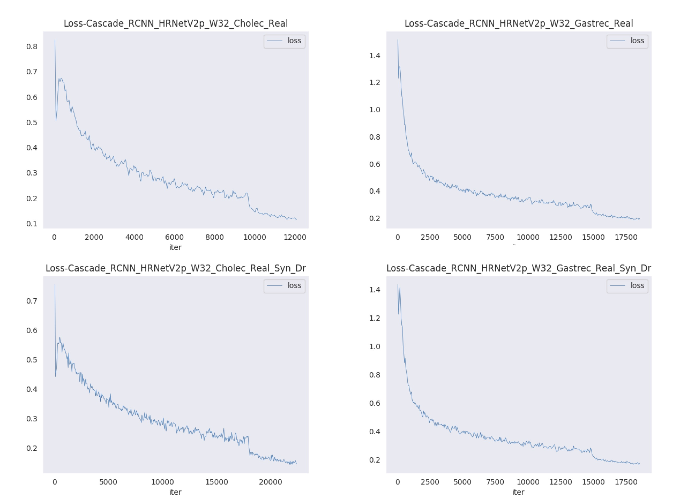

## hSDB-instrument: Instrument Localization Databse for Laparoscopic and Robotic Surgeries (Accepted at MICCAI 2021)

### What is hSDB-instrument dataset?

hSDB-instrument dataset is a new dataset that reflects the kinematic characteristics of surgical instruments for automated surgical tool recognition of surgical videos. The hSDB-instrument dataset consists of instruments information of cholecystectomy videos obtained from 24 cases of laparoscopic surgery and gastrectomy video obtained from 24 cases of robotic surgery for gastric cancer. Localization information for all tools is provided in the form of a bounding box for training using the object detection framework. At the same time, to handle class imbalance problem between tools, synthetic tools modeled in Unity for three-dimensional (3D) models are included as training data. In addition, we provide object detection models and their baseline performance trained on the hSDB-instrument dataset through MMDetection library. 


### Example Images

| Surgery Type | Data Type            | Image                                     |
| :----------- | :------------------- | :---------------------------------------- |
| Cholec.      | Real                 |    |
| Cholec.      | Synthetic            |      |
| Cholec.      | Domain randomization |        |
| Gastrec.     | Real                 |  |
| Gastrec.     | Synthetic            |    |
| Gastrec.     | Domain randomization |      |


### Dataset

- You can download data [here](https://drive.google.com/drive/folders/1SGc7KG4orD4MYPZdoYFECQbxl07Tf3hv?usp=sharing)
- Validation data is included with Real data.
- If you have any issues with data, send email to yjh2020@hutom.io

| Surgery Type | Data Type                                                    | Comments                                                     |
| :----------- | :----------------------------------------------------------- | :----------------------------------------------------------- |
| Cholec.      | [Real]                | Instrument information for a total of 24 cases of laparoscopic cholecystectomy |
| Cholec.      | [Real<br />+ Synthetic] | Instrument infromation of synthetic tools modeled in Unity for three-dimensional (3D) models generated by user is added to the cholec real dataset |
| Cholec.      | [Real<br />+ Domain randomization] | Instrument infromation of synthetic tools modeled in Unity for three-dimensional (3D) models generated by domain randomization is added to the cholec real dataset |
| Cholec.      | [Real<br />+ Synthetic<br />+ Domain randomization] | All kinds of synthetic dataset are added to the cholec real dataset |
| Gastrec.     | [Real]                | Instrument information for a total of 24 cases of robotic gastrectomy |
| Gastrec.     | [Real<br />+ Synthetic] | Instrument infromation of synthetic tools modeled in Unity for three-dimensional (3D) models generated by user is added to the gastrec real dataset |
| Gastrec.     | [Real<br />+ Domain randomization] | Instrument infromation of synthetic tools modeled in Unity for three-dimensional (3D) models generated by domain randomization is added to the gastrec real dataset |
| Gastrec.     | [Real<br />+ Synthetic<br />+ Domain randomization] | All kinds of synthetic dataset are added to the gastrec real dataset |


### Additional Statistics of hSDB-instrument

We  provide  additional  statistics  for  the  hSDB-instrument  dataset.  Additional statistics includes the absolute and relative amount of annotations in subparts of the tools and the tools itself. Table 1 shows the number of frames for each data split in the hSDB-instrument dataset. Table 2 shows the number of labels of each subpart of surgical instruments in the hSDB-instrument dataset. We added an equal amount of synthetic and domain randomization data to each imbalanced class. 


***Table 1.* The number of frames by surgery types and data split for the hSDB-instrument dataset.** The additional frames of synthetic and domain randomization data are highlighted in bold.

<div style="text-align: center"></div>

***Table 2.* The number of labels by instrument subpart for the hSDB-instrument dataset.** Synthetic and domain randomization data were added equally to each imbalanced class and the classes are highlighted in bold.

<div style="text-align: center"></div>

<div style="text-align: center"></div>


Figure 1 shows the relative amount of annotations of the subparts with the largest number of the subpart to 1.0 in laparoscopic cholecystectomy. Figure 1 compares the relative amount of the normalized number of supervision. The graph at the top is the statistic for the real dataset, and the graph at the bottom is the statistic for the real, synthetic (Syn), and domain randomization (DR) dataset. Figure 2 shows the same statistics as in Figure 1 in gastrectomy for gastric cancer.


***Figure 1*. The relative amount of annotation for each subpart of the tools used for laparoscopic cholecystectomy.** The largest number of annotations were normalized to 1.0.


***Figure 2.* The relative amount of annotation for each subpart of the tools used for robotic gastrectomy.** The largest number of annotations were normalized to 1.0.


Figures 3 and 4 show the number of annotations of the tools on a logarithmic scale. In figure 3, the tools that appear in laparoscopic cholecystectomy are largely divided into laparoscopic head, laparoscopic body, laparoscopic instrument tools, and auxiliary tools. Laparoscopic instrument tools are referred to as equipment such as suction-irrigation and electrichook that are not divided into subparts. Auxiliary tools are assistive tools, such as needle and specimen bag. The graph on the right is a statistic including the synthetic (Syn) and domain randomization (DR) dataset. The same manner is applied for robotic gastrectomy in figure 4. Figure 5 shows the proportion of annotations by the categories defined in Figure 3 and 4. Figure 6 also shows the proportion of annotations by the same categories including both laparoscopic and robotic instruments.


***Figure 3.* The number of annotations by instrument category for laparoscopic cholecystectomy.** The graph was plotted in a logarithmic scale.


***Figure 4.* The number of annotations by instrument category for robotic gastrectomy.** The graph was plotted in a logarithmic scale.


***Figure 5.* Proportion of annotations by instrument category for laparoscopic cholecystectomy.**


***Figure 6.* Proportion of annotations by instrument category for robotic gastrectomy.**


Table 3 shows the performance evaluation results of the most improved model (RetinaNet+ResNet50+FPN+align-gn-ms) by adding Syn+DR in both surgery types (laparoscopic cholecystectomy and robotic gastrectomy) and best models (FoveaBox+ResNeXt101+FPN+align-gn-ms) in each surgery type. Imbalanced classes are highlighted in bold. Most of the performances in mAP were improved with our synthetic and domain randomization dataset in both surgeries. The most improved model (RetinaNet+ResNet50+FPN+align-gn-ms) was improved significantly, more than 0.2 mAP in many classes and the highest improvement was 0.487 in mAP of the SmallClipApplier_Wrist in test set. Cascade R-CNN and FoveaBox were improved more than 0.1 mAP in each Overholt class and  Medium-LargeClipApplier class which are both imbalanced classes.


***Table 3.* Performance evaluation results from validation and test set with the most improved performance model (RetinaNet)  in both surgeries and best performance model in each surgery. Imbalanced classes are highlighted in bold.** Regardless of the type of surgery, most of the imbalanced classes showed improved performance.


### Additional Visualizations of hSDB-instrument

Figures 7 and 8 show visualizations of the tool position measurement for the different model and dataset. The probability threshold for visualization was set to 0.7. Figures 9 and 10 show the learning curve using the hSDB-instrument dataset. Figure 9 shows the total loss during training for each surgical type, model, and training set. Figure 10 shows the mAP for the validation set measured at each epoch according to the surgical type, model, and training set.


***Figure 7.* Visualization of MMDetection-based inference output for laparoscopic cholecystectomy.** For each video frame, it shows the output of the trained model with different architecture and composition of dataset. The confidence threshold for visualization was set at 0.7.


***Figure 8.* Visualization of MMDetection-based inference output for robotic gastrectomy.** For each video frame, it shows the output of the trained model with different architecture and composition of dataset. The confidence threshold for visualization was set at 0.7.



***Figure 9.* Learning curves in training using the hSDB-instrument dataset.** Total loss plots are shown for each surgical type, model, and training set.


***Figure 10.* Learning performance curve according to model in training using hSDB-instrument dataset.** The training for each surgical type, model, and training set shows the mAP at each epoch.


### Model Zoo

#### Baselines

More models with different backbones will be added to the model zoo (scroll right following table to download models).

| Surgery type | Model         | Bacbone      | Sub-module        | Dataset                                           | Epoch | mAP  | Download                                                     |
| :----------- | :------------ | :----------- | :---------------- | :------------------------------------------------ | :---- | :--- | ------------------------------------------------------------ |
| Cholec.      | Cascade R-CNN | HRNetV2p-W32 | -                 | Real                                              | 20    | 25.7 | [Download](https://drive.google.com/drive/folders/1FIeJUjgpLIy1IHWOj4iyMd9-9htzWmvu?usp=sharing) |
| Cholec.      | Cascade R-CNN | HRNetV2p-W32 | -                 | Real<br />+ Synthetic                             | 20    | 25.2 | [Download](https://drive.google.com/drive/folders/1xpMbvSPGOeDfLKaT5nBGaQOJ3lmudzeL?usp=sharing) |
| Cholec.      | Cascade R-CNN | HRNetV2p-W32 | -                 | Real<br />+ Domain randomization                  | 20    | 25.8 | [Download](https://drive.google.com/drive/folders/18hRQab7iFRoXEkNVUg5F56q_osF3Mtzh?usp=sharing) |
| Cholec.      | Cascade R-CNN | HRNetV2p-W32 | -                 | Real<br />+ Synthetic<br />+ Domain randomization | 20    | 27.1 | [Download](https://drive.google.com/drive/folders/1Coruxj39NWt2mF6ivfmPPlRZh5S-51MM?usp=sharing) |
| Cholec.      | FoveaBox      | ResNet101    | FPN + align-gn-ms | Real                                              | 12    | 23.7 | [Download](https://drive.google.com/drive/folders/1AR-9ceXfUj-UB-GPIDkv930S_LU5L25M?usp=sharing) |
| Cholec.      | FoveaBox      | ResNeXt101   | FPN + align-gn-ms | Real<br />+ Synthetic                             | 12    | 26.2 | [Download](https://drive.google.com/drive/folders/1RyCPB0mXoCrHR8NTAVniJS8xCWp-acin?usp=sharing) |
| Cholec.      | FoveaBox      | ResNeXt101   | FPN + align-gn-ms | Real<br />+ Domain randomization                  | 12    | 25.1 | [Download](https://drive.google.com/drive/folders/1Ed0DPfvMPnN05PHi7DX-yijqRZ3LJ5M9?usp=sharing) |
| Cholec.      | FoveaBox      | ResNeXt101   | FPN + align-gn-ms | Real<br />+ Synthetic<br />+ Domain randomization | 12    | 26.4 | [Download](https://drive.google.com/drive/folders/1z-qan-EsKZ8WtHhmtVdd9zWr5KyUUJ6S?usp=sharing) |
| Gastrec.     | Cascade R-CNN | HRNetV2p-W32 | -                 | Real                                              | 20    | 38.8 | [Download](https://drive.google.com/drive/folders/1vyiYUcmV-oX5pAjAsHW2CTfX2miICgwn?usp=sharing) |
| Gastrec.     | Cascade R-CNN | HRNetV2p-W32 | -                 | Real<br />+ Synthetic                             | 20    | 39.8 | [Download](https://drive.google.com/drive/folders/1w1n519M-2ePtYQUAXIOqxwHZIy-yclOy?usp=sharing) |
| Gastrec.     | Cascade R-CNN | HRNetV2p-W32 | -                 | Real<br />+ Domain randomization                  | 20    | 39.7 | [Download](https://drive.google.com/drive/folders/1XfVhCQrDZPKJOeLH6i64wGnHMZzuGhUi?usp=sharing) |
| Gastrec.     | Cascade R-CNN | HRNetV2p-W32 | -                 | Real<br />+ Synthetic<br />+ Domain randomization | 20    | 39.6 | [Download](https://drive.google.com/drive/folders/1sLeQJnqeWGyCi-qHAgRVVKf5fBInm3Ep?usp=sharing) |
| Gastrec.     | FoveaBox      | ResNeXt101   | FPN + align-gn-ms | Real                                              | 12    | 37.5 | [Download](https://drive.google.com/drive/folders/1NCu-gQAn7tbL2AUotCsAPRi39rcwJFAJ?usp=sharing) |
| Gastrec.     | FoveaBox      | ResNeXt101   | FPN + align-gn-ms | Real<br />+ Synthetic                             | 12    | 37.9 | [Download](https://drive.google.com/drive/folders/1nCJBSPoRYIpEzizNKOxCxo6VpVKEfAOK?usp=sharing) |
| Gastrec.     | FoveaBox      | ResNeXt101   | FPN + align-gn-ms | Real<br />+ Domain randomization                  | 12    | 38.6 | [Download](https://drive.google.com/drive/folders/1ZIeVblvaLb5AgQtpl7-566yXUo4L_0OM?usp=sharing) |
| Gastrec.     | FoveaBox      | ResNeXt101   | FPN + align-gn-ms | Real<br />+ Synthetic<br />+ Domain randomization | 12    | 40.7 | [Download](https://drive.google.com/drive/folders/1XEAiGoyVVPcaHGdO8fOQPzclPzgujHaA?usp=sharing) |


### Test baseline models

#### Installation 

##### Requirements

- Linux (Windows is not officially supported)
- Python 3.5+
- PyTorch 1.1 or higher
- CUDA 9.0 or higher
- NCCL 2
- GCC 4.9 or higher
- [mmcv](https://github.com/open-mmlab/mmcv)


##### Install mmdetection

We used **MMdetection library(v1.1.0)**  to train object detection models on the hSDB-instrument dataset. Following instruction is based on the official MMdetection documentation.

1. Create a conda virutal environment and activate it.

   ```bash
   conda create -n open-mmlab python=3.7 -y
   conda activate open-mmlab
   ```

2. Install Pytorch and torchvision follwoing the official instructions, e.g.,

   ```bash
   conda install pytorch torchvision cudatoolkit=10.1 -c pytorch
   ```

3. Clone the hsdb-instrument detection repository

   ```bash
   git clone https://github.com/hsdb-instrument/hsdb-mmdetection.git
   cd hsdb-mmdetection
   ```

4. Install build requirements and then install hsdb-instrument mmdetection. (We install pycocotools via the github repo instead of pypi because the pypi version is old and not compatible with the latest bumpy.)

   ```bash
   pip install -r requirements/build.txt
   pip install "git+https://github.com/cocodataset/cocoapi.git#subdirectory=PythonAPI"
   pip install -v -e .  # or "python setup.py develop"
   ```

Note:

1. The git commit id will be written to the version number with step d, e.g. 0.6.0+2e7045c. The version will also be saved in trained models. It is recommended that you run step d each time you pull some updates from github. If C++/CUDA codes are modified, then this step is compulsory.
2. Following the above instructions, mmdetection is installed on `dev` mode, any local modifications made to the code will take effect without the need to reinstall it (unless you submit some commits and want to update the version number).
3. If you would like to use `opencv-python-headless` instead of `opencv-python`, you can install it before installing MMCV.
4. Some dependencies are optional. Simply running `pip install -v -e .` will only install the minimum runtime requirements. To use optional dependencies like `albumentations` and `imagecorruptions` either install them manually with `pip install -r requirements/optional.txt`or specify desired extras when calling `pip` (e.g. `pip install -v -e .[optional]`). Valid keys for the extras field are: `all`, `tests`, `build`, and `optional`.


#### Inference with pretrained models

We provide testing scripts to inference sample images.

You can use the following commands to test sample images.

```bash
./hsdb_demo/demo_inference.sh ${CONFIG} ${CHECKPOINT} ${FRAME_IN_DIR} ${FRAME_OUT_DIR} [--score_thr ${SCORE_THRESHOLD}] [--cholec]
```

Optional arguments:

-  `SCORE_THRESHOLD`: Score threshold value of object detection class probablity. If not specified, the value will be 0.5 as default.
- `--cholec`: If specified, it is assumed that detection model and input images will be of cholecystectomy. If not, gastrectomy.


Examples:

Assume that you have already downloaded the checkpoint and config file to the directory `hsdb_demo/checkpoints_configs/`.

1. Test Cascade R-CNN HRNetV2p-W32 and cholecytectomy dataset.

   ```bash
   ./hsdb_demo/demo_infernce.sh --cholec
   ```

2. Test Cascade R-CNN HRNetV2p-W32 with 0.7 threshold and gastrectomy dataset.

   ```bash
   ./hsdb_demo/demo_inference.sh --score_thr 0.7
   ```

